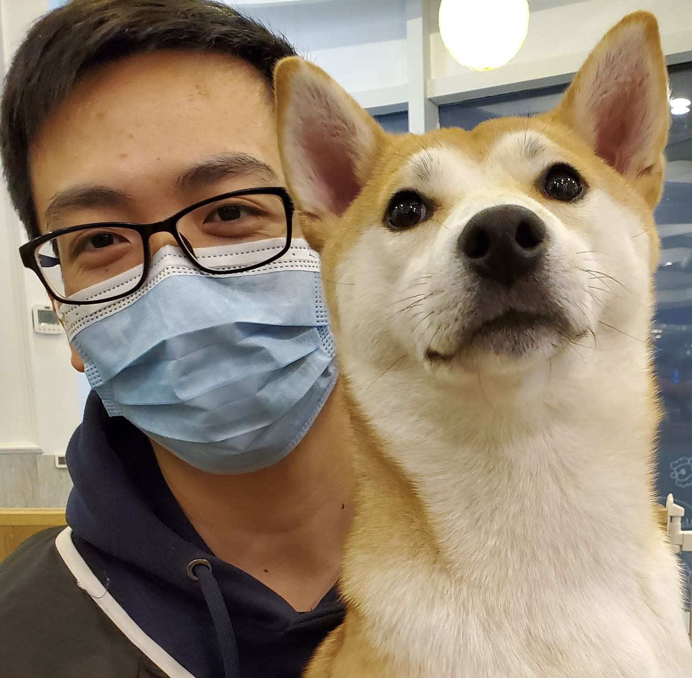

## Biography

I am a second-year Ph.D. student from Fudan University majoring in Computer Science. 
Before that, I obtained my master's degree in Computer Science from ShanghaiTech University advised by [Prof. Ning Cai](https://sist.shanghaitech.edu.cn/sist_en/2020/0814/c7582a54749/page.htm) and my Bachelor’s degree from Xidian University in Spatial Information and Digital Technology.

## Experience
* **Research Intern**, Amazon Web Services AI-Lab, Shanghai, China, Dec. 2020 ~ Jul. 2022
    - With [Dr. Yi Zhu](https://bryanyzhu.github.io/).
    - Investigated large-scale pre-training pipeline for object-level representation.
* **Research Intern**, Tencent GY-Lab, Shanghai, China, Apr. 2020 ~ Aug. 2020
    - with [Dr. Gang Yu](https://www.skicyyu.org/).
    - Investigated make-up transfer models for human face.

## Research Interests

I am currently working on the following topics:
* Deep learning: unsupervised/self-supervised learning, open-set, long-tailed distribution
* Computer vision: object detection, semantic segmentation
* Information theory

